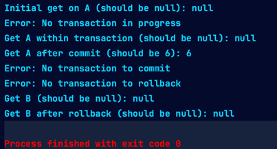

# Data Processing Storage Assignment

## In-Memory Database with Transaction Support (Java Implementation)

Implementation of a Java-based in-memory database for a Data Processing and Storage Assignment. It supports key-value storage and transaction handling, simulating real-world database operations.

### Running the Code

#### Prerequisites
- Java Development Kit (JDK), version 17 or higher (as version 20 used in development).
- An IDE like IntelliJ IDEA or Eclipse, though the code is simple enough to be run from any Java-compatible environment.

#### Steps to Run
1. Clone the repository from `https://github.com/mkeloo/DataProcessingStorageAssignment`.
2. Open the project in your preferred IDE.
3. Confirm JDK 17 (or higher) is set as the project SDK.
4. Locate the `Main.java` file in the `src` directory to find the main method.
5. Execute the `Main` class to observe the demonstration of the in-memory database functionality.

#### Expected Output

### Suggestions for Future Assignment Iterations

For future improvements, I would suggest the following:
- **Concurrency**: Include guidelines or examples for handling multiple transactions simultaneously, which will focus more on thread safety aspect of the assignment as well.
- **Testing Requirements**: Require unit tests to improve understanding and promote good coding practices for this assignment. So, student weil basically be writing unit tests in the programming language of their choosing for this assignment.
- **Data Storage**: Allow for the storage of the data in a file, so that the data is not lost when the program is terminated. This will also allow for the data to be loaded from the file when the program is started again.
- **Data Types**: Allowing for more complex data types such as custom objects or lists, to increase the challenge. Just more of a DSA practice at this point.
- **Performance**: Add instructions on optimizing the program for large datasets for a more practical experience of this kind of example assignment. This could include using a more efficient data structure for the storage of the data, or using a more efficient algorithm for the transaction rollback process.
